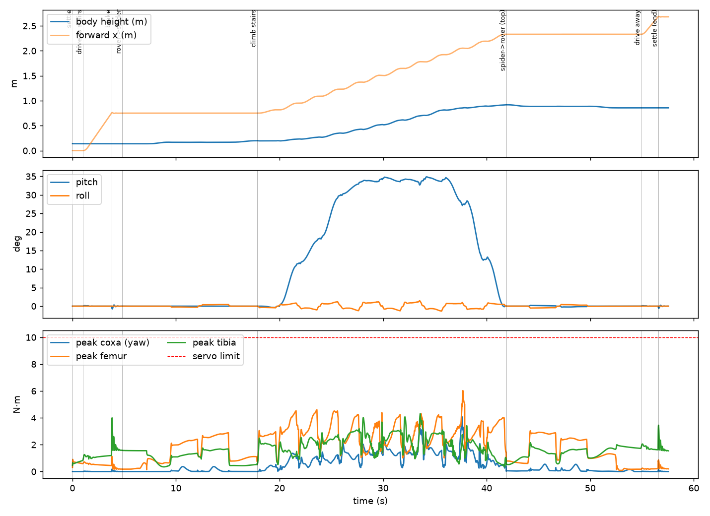

# Wheel-legged hexapod: rover ⇄ spider transformation and stair climbing

A MuJoCo simulation of a small (≈5.8 kg, no rider) robot that **drives on four
wheels around the house, transforms into a six-legged spider at a staircase,
climbs it, and transforms back**. It exists to test the "transformer" idea:
*does changing shape actually pay off, and what does the hardware need to be?*

> This folder is self-contained and unrelated to the face-recognition app in
> the rest of the repository.



`results/mission.mp4` is a render of the full run.

## Run it

```bash
cd robotics/hexapod_sim
pip install -r requirements.txt
python run_demo.py --compare                 # mission + rolling-vs-walking energy
MUJOCO_GL=osmesa python run_demo.py --video results/mission.mp4   # headless video
python experiments.py                        # torque + staircase sweeps
python experiments.py --robust 20            # 20 randomised trials
python -m pytest -q                          # kinematics + physics tests (~4 s)
```

## The robot

| | |
|---|---|
| Body | 40×18×6 cm torso, 2.6 kg (battery/electronics) |
| Legs | 6 × 3-DOF (coxa yaw, femur, tibia): 4 cm / **20 cm / 24 cm** |
| Wheels | 4 corner legs end in a 10 cm drive wheel; the 2 middle legs end in rubber feet |
| Actuators | 18 joint servos + 4 wheel motors = 22; total mass 5.84 kg |
| Rover mode | wheels folded under the hips, middle legs stowed, body 14 cm high, skid-steer |
| Spider mode | legs splayed, body 20 cm high, wheels **braked and used as feet** |

**Transformation** (always ≥ 4 feet planted): deploy middle legs → raise body →
swing the left wheels out → swing the right wheels out → raise to spider
height. The reverse folds it back. **Climbing** is an alternating-tripod crawl
(3 feet always down) with foothold positions snapped to safe tread areas, body
pitch following the stair slope, and a per-step re-measurement of pose and
planted feet to correct drift.

Every move (transform and gait) is one mechanism: world-frame foot paths +
body trajectory → inverse kinematics → position servos (`hexapod_sim/choreo.py`).

## Results (default 4-step, 18 cm rise × 26 cm tread, 90 cm wide staircase)

| | |
|---|---|
| Mission | **success**: climbs 72 cm, ends as a rover on the landing at the expected height |
| Time | ≈ 58 s total; 13 s to transform, 24 s to climb |
| Body attitude | pitch tracks the stairs (≤ 35°), roll ≤ 1.5° |
| Sideways drift | 1.9 cm (11 cm *without* the per-step correction) |
| Collisions | no leg/wheel/body clashes (self-collision is simulated) |
| Peak servo torque | femur **6.0 N·m**, tibia 4.3, coxa 4.1 |
| Robustness | **20/20** randomised runs (friction ±30 %, payload −15…+25 %, start offset ±5 cm, heading ±3°) |

### What it says about the "transformer" theory

* **Rolling is ~12× cheaper than walking on flat floor** (cost of transport
  0.63 vs 7.5, same robot, 1 m). Transforming only pays off where wheels
  cannot go.
* **Changing shape is cheap relative to the trip:** the rover→spider
  transformation costs ≈155 J, about the energy of rolling 4 m. The stair climb
  costs ≈1000 J. So "roll everywhere, transform only at stairs" is the right
  strategy for this design.
* **The geometry was the first thing the simulation changed.** The first
  concept (16/20 cm links, wide stance) could *not* reach: on a 35° staircase
  the foot rows are 31 cm apart along the slope, which pushed rear feet 54 cm
  from the body. Links grew to 20/24 cm and the stance narrowed.
* **Servos are the expensive part.** Peak femur torque is ~6 N·m typical and
  9.7 N·m in the worst randomised trial: **60–100 kg·cm servos × 18**, well
  above common hobby servos (≈ 35–45 kg·cm). Lighter bodies or quasi-direct
  drive actuators are the way to cut this.

## Honest limitations (read before trusting a number)

* **Reach is marginal at the top of the stairs.** While the front legs step
  onto the landing and the body pitches level, the rear legs are fully
  stretched: 91 control ticks per run are up to 1.9 cm short of the target.
  The climb still succeeds, but a few more cm of leg or a smarter hand-over
  would add margin.
* **One of 20 randomised runs was a near miss** (53° pitch excursion, 9.7 N·m):
  success rate is 100 % but not with comfortable margin.
* **The torque sweep is not monotonic** (3 N·m "passes", 4 N·m falls, ≥ 5 N·m
  pass). Read it as "marginal below ≈ 5 N·m", not as a clean threshold.
* **Staircase sweep** (`results/sweeps.json`): 11/12 geometries climbed, but the
  30 cm-tread stairs pin the coxa servos at their 10 N·m limit, and
  15 cm × 26 cm hit a planner convergence failure (a planner limitation, not
  a physical one).
* **Idealised parts.** Servos are position-controlled with a torque clamp: no
  backlash, latency, back-drive, thermal limits or battery sag. Wheel motors are
  also modelled as position servos. Friction values are assumptions.
* **Perfect perception.** Stair geometry is given; the foothold "snap" stands
  in for depth-camera stair detection. Pose is read from the simulator.
* **Energy numbers are a proxy.** Electrical energy = mechanical work + copper
  loss with an assumed servo constant (`metrics.MOTOR_CONST`). Use them to
  compare modes, not as battery-life predictions.
* **Not covered:** descending, turning on stairs, landings/turns, carpets,
  dynamic gaits, impact loads on the stair nose.

## Layout

```
hexapod_sim/config.py      all dimensions, masses, servo limits
hexapod_sim/kinematics.py  analytic leg IK/FK
hexapod_sim/model.py       MJCF generator (robot + stairs)
hexapod_sim/choreo.py      foot/body choreography engine
hexapod_sim/plans.py       stances, transformation, stair gait
hexapod_sim/analysis.py    physics-free reach / stability-margin checks
hexapod_sim/sim.py         MuJoCo wrapper, control, logging, video
hexapod_sim/mission.py     end-to-end mission + rover-vs-spider comparison
experiments.py             torque / staircase sweeps, randomised trials
tests/                     kinematics + physics integration tests
```

## Suggested next steps

1. Add leg length/spacing margin at the top transition (or a better hand-over),
   then re-run `--robust 100`.
2. Model real servos (latency, backlash, torque-speed curve) and the wheel
   hub motors.
3. Stair **descent**, then turning/landings.
4. Replace the stair oracle with a simulated depth camera.
5. Build a **single leg test rig** to validate torque and the wheel-as-foot
   contact before committing to 22 actuators.
